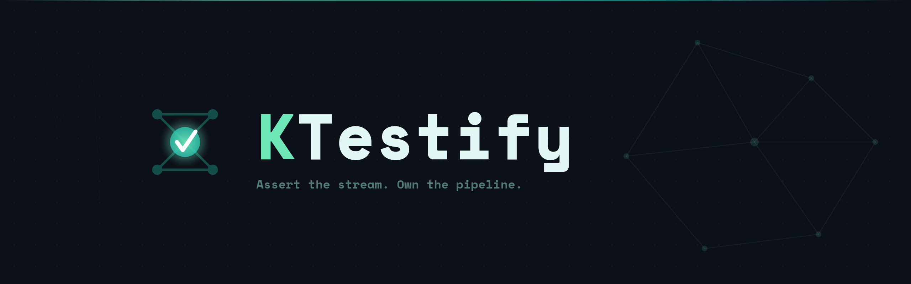
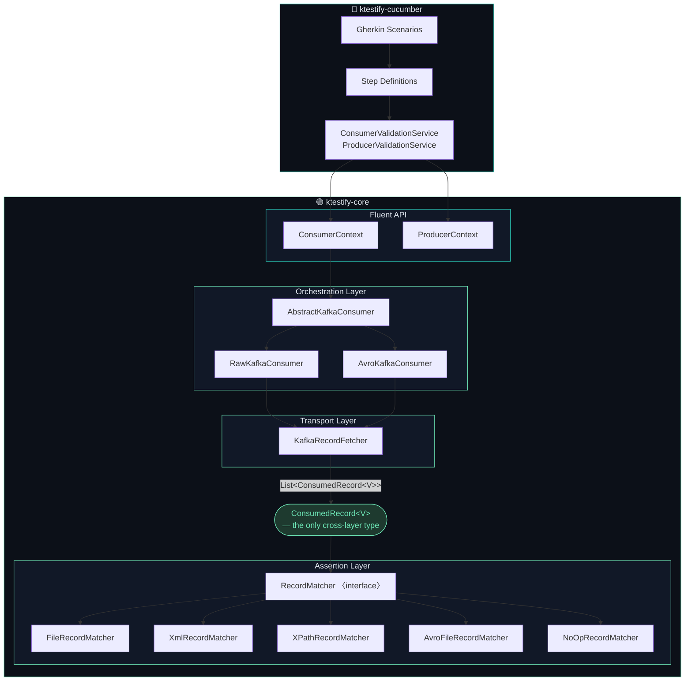

<p align="center">
  
</p>

<p align="center">
  
  
  
  
</p>

<br/>

**KTestify** is an open-source, modular testing framework for [Apache Kafka](https://kafka.apache.org/) and Kafka
Streams. It lets you write expressive, reliable stream tests, from low-level message assertions using a fluent Java API,
all the way up to full BDD scenarios described in plain Gherkin.

---

## Main Repositories

<table>
<tr>
<td width="50%" valign="top">

### 🟢 [ktestify-core](https://github.com/ktestify/ktestify-core)

The foundation library. A fluent Java API for testing Kafka producers, consumers, and Kafka Streams topologies, with no
Cucumber dependency.

**What it gives you:**

- Fluent producer & consumer DSL via `ConsumerContext` / `ProducerContext`
- Kafka Streams topology test harness
- Rich message matchers: JSON file, XML, XPath, positional fields, key-only, batch
- Full Avro support (Schema Registry, `GenericRecord` matching, excluded fields)
- Dynamic variable system in payloads: `{{DATE:...}}`, `{{ENV:...}}`, `{{RANDOM:...}}`
- HOCON configuration (`reference.conf` + environment variable overrides)
- Transport-agnostic design, extensible `RecordFetcher<V>` contract

```java
ConsumerContext<String, String> ctx = ConsumerContext.<String, String>builder()
        .topic(outputTopic)
        .matchMethod(ConfigConstants.methodMatchFile)
        .matchFilePaths(List.of("expected/order.json"))
        .readTimeout(Duration.ofSeconds(30))
        .build();

Boolean passed = new RawKafkaConsumer(ctx).call();

assertTrue(passed);
```

</td>
<td width="50%" valign="top">

### 🥒 [ktestify-cucumber](https://github.com/ktestify/ktestify-cucumber)

A **standalone BDD test runner**. Uses Cucumber 7 + Gherkin to express Kafka stream scenarios in plain language, backed
by the ktestify-core API.

**What it gives you:**

- Ready-to-use Gherkin step definitions for every matching strategy
- Scenario-scoped Kafka lifecycle (Testcontainers, no Docker Compose needed)
- Avro and raw (JSON/XML/text) scenarios in the same suite
- Batch consumer assertions (`expectedRecordsCount`)
- `consumerReadTimeout` and `consumerDeltaTime` per-scenario tuning
- Shell script execution steps (`ScriptService`)
- Rich CI reports via [cucumber-reportr](https://github.com/nil-malh/cucumber-reportr)

```gherkin
Background:
Given namespace
| namespace |
| ktestify  |
Given input topic
| topicName     | topicAlias |
| raw-roundtrip | orders-in  |
Given output topic
| topicName     | topicAlias |
| raw-roundtrip | orders-out |

Scenario: Order enrichment, JSON file match
When record from file is sent
| topicName     | file              | recordKey |
| raw-roundtrip | data/order.json   | order-123 |
Then expected record from file
| topicAlias | file                    | expectedRecordKey |
| orders-out | expected/order.json     | order-123         |
```

</td>
</tr>
</table>

## Plugin Repositories

KTestify provides a Plugin system based on SPI (Service Provider Interface) to allow third-party libraries to extend its
capabilities without modifying the core codebase. Plugins can introduce new matchers, transport implementations, or
orchestration strategies.

You can learn more on how to create your own plugin in
the [Plugin Development Guide](https://docs.ktestify.xyz/docs/extend/plugins). Below are first-party plugin that are
integrated and ready to use with ktestify-cucumber out of the box.

<table>
<tr>
<td width="50%" valign="top">

### 🛎️ [ktestify-plugin-notifications](https://github.com/ktestify/ktestify-plugin-notifications)

Cross-platform test suite notifications for **ktestify-cucumber**. Sends a rich summary card at the end of each test
run, with per-tag group breakdowns, CI/Git context, and configurable success-rate thresholds.

**What it gives you:**

- Four built-in channels: **Teams** (Adaptive Card), **Slack** (Block Kit), generic **HTTP webhook**, and a
  zero-dependency **log** channel
- Tag-based scenario grouping, each group gets its own success rate and colour-coded style in the card
- Auto-detected CI/CD context (GitLab CI, GitHub Actions, CircleCI, Jenkins…) via `cucumber-cienvironment`
- Visual thresholds: `good` ≥ 75 %, `warning` ≥ 50 %, `attention` < 50 %
- Fully overridable templates, inline HOCON, classpath resource, filesystem path, or bundled defaults
- Extensible via SPI, custom channels registered in `META-INF/services/` are discovered automatically
- Async and failure-safe, notifications run in a background thread pool and never block a test run

```hocon
ktestify.plugins.notifications {
  enabled = true
  channels = [
    {
      type = "teams"
      enabled = true
      webhook-url = ${?KTESTIFY_TEAMS_WEBHOOK_URL}
      on-failure-only = false
    }
  ]
}
```

</td>
<td width="50%" valign="top">

### ☁️ [ktestify-plugin-azureblob](https://github.com/ktestify/ktestify-plugin-azureblob)

**Azure Blob Storage** transport support for **ktestify-cucumber**. Ready-to-use Gherkin steps for uploading and
asserting blobs are discovered automatically.

**What it gives you:**

- Gherkin step definitions for blob upload, assertion, and negative presence checks
- Seamless integration alongside Kafka steps in the same scenario
- Three auth modes, connection string, SAS token, or managed identity endpoint
- Auto-create containers on first use (configurable)
- Local development support via **Azurite** emulator with `UseDevelopmentStorage=true`
- Zero-config discovery via SPI, the plugin registers itself through `META-INF/services/`

```hocon
ktestify.plugins.azure-blob {
  connection-string = ${?AZURE_STORAGE_CONNECTION_STRING}
  request-timeout = 30s
  auto-create-containers = true
}
```

</td>
</tr>
</table>

---

## Architecture

KTestify enforces a strict three-layer separation so that transports, orchestration logic, and assertion strategies are
completely decoupled. `ConsumedRecord<V>` is the **only data type that crosses layer boundaries**.



### Matcher catalogue

| Match strategy                   | Raw (String) | Avro (GenericRecord) |
|----------------------------------|:------------:|:--------------------:|
| JSON file comparison             |      ✅       |          ✅           |
| Key + value file comparison      |      ✅       |          ✅           |
| Positional fields (line/from/to) |      ✅       |          ✅           |
| XML structural comparison        |      ✅       |          X           |
| XPath expression matching        |      ✅       |          X           |
| Record key only                  |      ✅       |          ✅           |
| Batch (N records vs N files)     |      ✅       |          ✅           |
| No-op (presence check)           |      ✅       |          ✅           |

---

## Quick Start

### 1, Add the dependencies

**ktestify-core**, embed the assertion API in your own test project:

```xml
<dependency>
    <groupId>io.github.ktestify</groupId>
    <artifactId>ktestify-core</artifactId>
    <version>0.1.0</version>
    <scope>test</scope>
</dependency>
```

**ktestify-cucumber**, run BDD scenarios as a standalone test application:

```xml
<dependency>
    <groupId>io.github.ktestify</groupId>
    <artifactId>ktestify-cucumber</artifactId>
    <version>0.1.3</version>
    <scope>test</scope>
</dependency>
```

### 2, Configure (HOCON)

Drop an `application.conf` next to your features to override any default:

```hocon
ktestify {
  kafka.bootstrap-servers = "localhost:9092"
  kafka.topic-namespace = "my-app"
  schema-registry.url = "http://localhost:8081"
  framework.timeouts {
    default-read-timeout = 30s
    consumer-delta-time = 60s
  }
  framework.directories.assets = "src/test/resources/data"
}
```

All values can also be set via environment variables (`KTESTIFY_KAFKA_BOOTSTRAP_SERVERS`,
`KTESTIFY_SCHEMA_REGISTRY_URL`, `KTESTIFY_TOPIC_NAMESPACE`, `KTESTIFY_ASSETS_DIR`, …).

### 3, Run your scenarios

Via Maven (integration-tests profile):

```bash
mvn verify -Pintegration-tests -Dcucumber.it.tags="@integration"
```

Or directly as a fat-JAR:

```bash
java -Dconfig.file=docker/local.conf \
     -jar target/ktestify-cucumber.jar \
     --tags "@integration" \
     --plugin "json:target/cucumber-reports/cucumber.json" \
     src/test/resources/features
```

---

## The Gherkin DSL, at a glance

### Background (setup)

```gherkin
Given namespace          | namespace  |  → declare topic namespace
Given input topic        | topicName | topicAlias | namespace |  → INPUT topic
Given output topic       | topicName | topicAlias |           |  → OUTPUT topic
Given schema             | schemaName | schemaAlias | schemaVersion |  → Avro schema
Given assets directory   | absolutePath |  → base path for payload files
```

### Actions (`@When`)

```gherkin
When record from file is sent
| topicName | file | recordKey | headerFile |

When record from file based on schema is sent
| topicName | file | schemaName | recordKey |

And wait for {int} seconds

When script is executed
| scriptPath | scriptArgs |
```

### Validations (`@Then` / `@And`)

```gherkin
Then expected record from file
| topicAlias | file | expectedRecordKey | consumerReadTimeout | consumerDeltaTime |

Then expected record from file based on XML
| topicAlias | file | excludedElements |

Then expected record based on XML should have fields matching from file
| topicAlias | file | xpathExpressions |

Then expected records from files                          ← batch
| topicAlias | expectedRecordsCount | files | consumerReadTimeout |

Then expected record from file based on schema            ← Avro
| topicAlias | file | excludedKeys |

And record should not appear in topic                     ← negative watcher
| topicAlias | topicType | consumerReadTimeout | consumerDeltaTime |
```

---

## Why KTestify?

|                               | KTestify | Plain Kafka Clients | EmbeddedKafka |
|-------------------------------|:--------:|:-------------------:|:-------------:|
| Fluent assertion DSL          |    ✅     |          ❌          |       ❌       |
| BDD / Gherkin support         |    ✅     |          ❌          |       ❌       |
| Avro + Schema Registry        |    ✅     |      ⚠️ manual      |       ❌       |
| XML / XPath matchers          |    ✅     |          ❌          |       ❌       |
| Batch record assertions       |    ✅     |          ❌          |       ❌       |
| Dynamic variables in payloads |    ✅     |          ❌          |       ❌       |
| Embedded broker lifecycle     |    ✅     |      ⚠️ manual      |       ✅       |
| Transport-agnostic design     |    ✅     |          ❌          |       ❌       |
| CI-friendly                   |    ✅     |          ✅          |       ✅       |

---

## Project Status

| Repository                                                                                 | Status    | Version          |
|--------------------------------------------------------------------------------------------|-----------|------------------|
| [ktestify-core](https://github.com/ktestify/ktestify-core)                                 | 🟢 Active | `0.1.1`          |
| [ktestify-cucumber](https://github.com/ktestify/ktestify-cucumber)                         | 🟢 Active | `0.1.4`          |
| [ktestify-plugin-azureblob](https://github.com/ktestify/ktestify-plugin-azureblob)         | 🟢 Active | `0.1.0`          |
| [ktestify-plugin-notifications](https://github.com/ktestify/ktestify-plugin-notifications) | 🟢 Active | `0.1.0`          |

---

## Contributing

Contributions are welcome! Please read the contributing guide in each repository before opening a pull request.

1. Fork the repository
2. Create a feature branch : `git checkout -b feat/my-feature`
3. Commit using [Conventional Commits](https://www.conventionalcommits.org/) : `git commit -m 'feat: add my feature'`
4. Push and open a Pull Request against `main`

---

## License

KTestify is licensed under the [Apache License 2.0](https://www.apache.org/licenses/LICENSE-2.0.txt).

---

<p align="center">
  
  <br/>
  <sub>Assert the stream. Own the pipeline.</sub>
</p>
